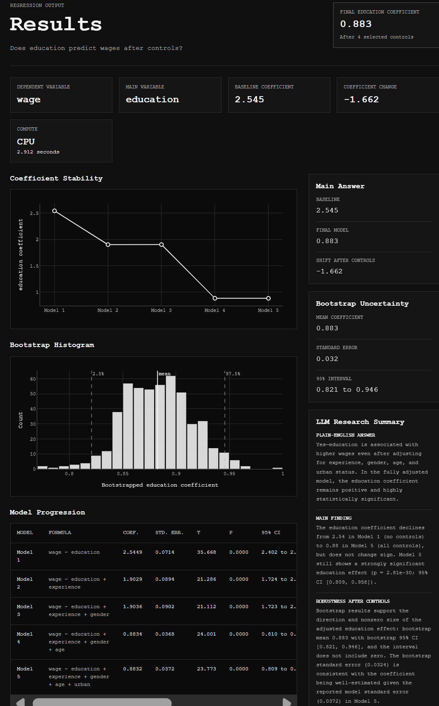

# RegressAI

RegressAI is a Python-first, browser-based regression analysis and stress-testing tool for students, researchers, and anyone looking for a web-based tool to get insights from their data with an AI generated explanation. Users upload a dataset, define a research question, choose a dependent variable, choose a main independent variable, add controls, and view regression results explained in a clean, AI-assisted, interactive dashboard.

## What Users Can Do

- Upload a CSV and inspect its columns instantly.
- Turn a research question into a regression setup.
- Pick dependent, main independent, and control variables.
- Run baseline and controlled OLS models in the browser.
- See how the main coefficient changes as controls are added.
- Review coefficients, p-values, and R-squared.
- Explore coefficient stability with an interactive Plotly chart.
- View bootstrap uncertainty and a bootstrap coefficient histogram.
- Run CPU analyses and receive deterministic research summaries without an account.
- Log in to offload eligible bootstrap workloads to CUDA-enabled cloud GPU workers.
- Log in to receive AI-generated interpretation of regression results.
- Export PDF and LaTeX reports while signed in or signed out.

The goal is to help students, research assistants, and researchers quickly answer:

> Is this regression relationship stable, fragile, or misleading?

> How can I interpret the control variables in my model?

Expensive bootstrap workloads can be offloaded to CUDA-enabled GPU workers through RunPod Serverless.

## Cloud GPU execution

Cloud execution is optional, account-gated, and disabled by default. Signed-out analyses always use the existing statsmodels CPU implementation and a deterministic research summary; they never call OpenAI or RunPod. Signed-in eligible analyses may use cloud GPU and LLM features when those providers are configured. RegressAI prepares one finite numeric matrix locally, replaces user column names with neutral identifiers, compresses it, and sends only that matrix plus the model specification to a RunPod Serverless worker.

The initial worker target is an A4000 Flex worker with zero active workers and one maximum worker. 

For signed-in users, the measured policy routes jobs at 60,000,000 work units. Analyses above 2,000 bootstrap iterations also require the user to explicitly enable cloud GPU computing in the configuration form; this consent does not bypass the measured workload threshold. Each account is limited to 3 GPU runs per day and 30 per month.

## CPU/GPU benchmarks

Live A4500 Benchmarks:

(Medium workloads are most similar to production data traffic)

<!-- BENCHMARK_RESULTS_START -->
| Workload | CPU median | GPU compute median | GPU warm/cold E2E | Compute speedup | E2E speedup | GPU cost | Parity | Routing evidence |
|---|---:|---:|---:|---:|---:|---:|---|---|
| Small A | 2.904s | 0.423s | 2.255s / 3.189s | 6.86× | 1.29× (22.3% faster) | $0.0004 | pass | parity-only |
| Small B | 3.960s | 1.578s | 6.080s / — | 2.51× | 0.65× (53.5% slower) | $0.0010 | pass | parity-only |
| Medium A | 3.964s | 1.102s | 2.287s / — | 3.60× | 1.73× (42.3% faster) | $0.0004 | pass | eligible |
| Medium B | 20.011s | 5.159s | 7.062s / — | 3.88× | 2.83× (64.7% faster) | $0.0012 | pass | eligible |
| Large A | 68.248s | 7.200s | 10.184s / 21.990s | 9.48× | 6.70× (85.1% faster) | $0.0018 | pass | eligible |
<!-- BENCHMARK_RESULTS_END -->

## Results Page

